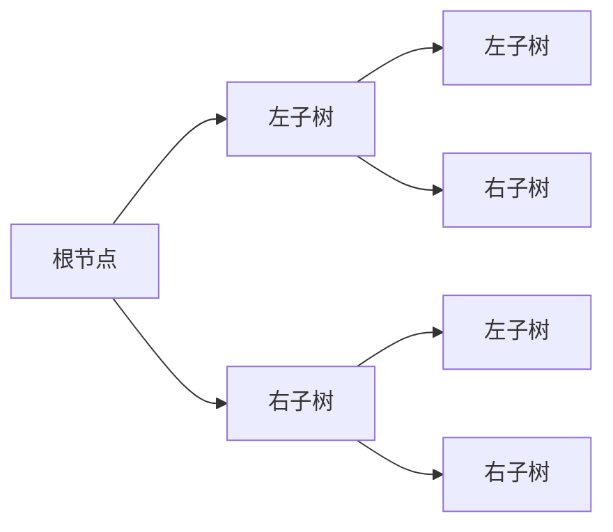

# 6. 二叉树

## 定义

二叉树是每个节点最多有两个子树的树结构。通常子树被称作“左子树”（left subtree）和“右子树”（right subtree）。

- 结构



## 二叉树的性质

- 在二叉树的第 i 层上至多有 2^(i-1) 个结点（i>=1）。
- 深度为 k 的二叉树至多有 2^k - 1 个结点（k>=1）。
- 对任何一棵二叉树 T，如果其终端结点数为 n0，度为 2 的结点数为 n2，则 n0 = n2 + 1。
- 具有 n 个结点的完全二叉树的深度为 [log2n]+1。
- 如果对一棵有 n 个结点的完全二叉树（其深度为 [log2n]+1）的结点按层序编号（从第 1 层到第 [log2n]+1 层，每层从左到右），对任一结点 i（1<=i<=n）有：
  - 如果 i=1，则结点 i 是二叉树的根，无双亲；如果 i>1，则其双亲是结点 [i/2]。
  - 如果 2i>n，则结点 i 无左孩子（结点 i 为叶子结点）；否则其左孩子是结点 2i。
  - 如果 2i+1>n，则结点 i 无右孩子；否则其右孩子是结点 2i+1。
  - 二叉树的结点按层序编号的结果是一个顺序表。
- 二叉树的叶子结点数为 n0，度为 2 的结点数为 n2，则 n0 = n2 + 1。
- 二叉树的任何一棵子树的结点数最多为原树结点数的一半。
- 二叉树的任何一棵子树的高度最多为原树高度的一半。
- 二叉树的任何一棵子树的结点数最多为原树结点数的一半。

## 二叉树的存储结构

### 顺序存储结构

- 顺序存储结构是指用一组地址连续的存储单元依次存储二叉树的结点数据元素，这种存储结构只适用于完全二叉树。
- 顺序存储结构的存储空间利用率不高，因为在完全二叉树中，只有叶子结点的度可能小于 2，而度为 1 的结点在顺序存储结构中也要占用一个存储单元。

### 链式存储结构

- 链式存储结构是指用一组任意的存储单元存储二叉树的结点数据元素，这种存储结构不仅适用于完全二叉树，也适用于非完全二叉树。
- 二叉链表是二叉树的链式存储结构，它是由二叉树的结点构成的单链表，每个结点包含三个域：数据域、左指针域和右指针域。

## 二叉树的遍历

::: tabs#fruit

@tab 先序遍历

```c
void PreOrder(BiTree T)
{
    if(T == NULL)
        return;
    printf("%c", T->data);
    PreOrder(T->lchild);
    PreOrder(T->rchild);
}
```

@tab 中序遍历

```c
void InOrder(BiTree T)
{
    if(T == NULL)
        return;
    InOrder(T->lchild);
    printf("%c", T->data);
    InOrder(T->rchild);
}
```

@tab 后序遍历

```c
void PostOrder(BiTree T)
{
    if(T == NULL)
        return;
    PostOrder(T->lchild);
    PostOrder(T->rchild);
    printf("%c", T->data);
}
```

:::

## 二叉树的线索化

- 二叉树的线索化是指将二叉树中某些空指针改为指向其在某种遍历次序下的前驱或后继结点的指针，这样就不必在遍历的过程中反复地判断当前结点的左右孩子是否为空，从而使得遍历过程更加高效。
- 二叉树的线索化可以分为两种：中序线索化和前序线索化。
- 中序线索化的过程是：对二叉树进行中序遍历，当遍历到某个结点时，如果该结点的左孩子为空，则将其左孩子指针指向其在中序遍历下的前驱结点，如果该结点的右孩子为空，则将其右孩子指针指向其在中序遍历下的后继结点。
- 前序线索化的过程是：对二叉树进行前序遍历，当遍历到某个结点时，如果该结点的左孩子为空，则将其左孩子指针指向其在前序遍历下的前驱结点，如果该结点的右孩子为空，则将其右孩子指针指向其在前序遍历下的后继结点。

## 二叉树的应用

- 二叉树的应用非常广泛，它是一种非常重要的数据结构，它的应用领域包括：编译原理、操作系统、数据库、图形学、人工智能、计算机网络、数据压缩、数据加密、数据结构等。

## 实现

### 二叉树的链式存储结构

```c
typedef struct BiTNode
{
    char data;
    struct BiTNode *lchild, *rchild;
}BiTNode, *BiTree;
```

### 初始化

```c
BiTree InitBiTree()
{
    BiTree T;
    T = (BiTree)malloc(sizeof(BiTNode));
    T->lchild = NULL;
    T->rchild = NULL;
    return T;
}
```

### 插入

```c
void InsertBiTree(BiTree T, char data, char Ldata, char Rdata)
{
    if(T == NULL)
        return;
    if(T->data == data)
    {
        if(Ldata != '#')
        {
            BiTree p = (BiTree)malloc(sizeof(BiTNode));
            p->data = Ldata;
            p->lchild = NULL;
            p->rchild = NULL;
            T->lchild = p;
        }
        if(Rdata != '#')
        {
            BiTree p = (BiTree)malloc(sizeof(BiTNode));
            p->data = Rdata;
            p->lchild = NULL;
            p->rchild = NULL;
            T->rchild = p;
        }
    }
    InsertBiTree(T->lchild, data, Ldata, Rdata);
    InsertBiTree(T->rchild, data, Ldata, Rdata);
}

// 插入左孩子
void InsertLeft(BiTree T, char data, char Ldata)
{
    if(T == NULL)
        return;
    if(T->data == data)
    {
        if(Ldata != '#')
        {
            BiTree p = (BiTree)malloc(sizeof(BiTNode));
            p->data = Ldata;
            p->lchild = NULL;
            p->rchild = NULL;
            T->lchild = p;
        }
    }
    InsertLeft(T->lchild, data, Ldata);
}

// 插入右孩子
void InsertRight(BiTree T, char data, char Rdata)
{
    if(T == NULL)
        return;
    if(T->data == data)
    {
        if(Rdata != '#')
        {
            BiTree p = (BiTree)malloc(sizeof(BiTNode));
            p->data = Rdata;
            p->lchild = NULL;
            p->rchild = NULL;
            T->rchild = p;
        }
    }
    InsertRight(T->rchild, data, Rdata);
}
```

### 删除

```c
void DeleteBiTree(BiTree T, char data)
{
    if(T == NULL)
        return;
    if(T->lchild != NULL && T->lchild->data == data)
    {
        T->lchild = NULL;
        return;
    }
    if(T->rchild != NULL && T->rchild->data == data)
    {
        T->rchild = NULL;
        return;
    }
    DeleteBiTree(T->lchild, data);
    DeleteBiTree(T->rchild, data);
}
```

### 查找

```c
BiTree SearchBiTree(BiTree T, char data)
{
    if(T == NULL)
        return NULL;
    if(T->data == data)
        return T;
    BiTree p = SearchBiTree(T->lchild, data);
    if(p != NULL)
        return p;
    p = SearchBiTree(T->rchild, data);
    if(p != NULL)
        return p;
    return NULL;
}
```

### 深度

```c
int DepthBiTree(BiTree T)
{
    if(T == NULL)
        return 0;
    int l = DepthBiTree(T->lchild);
    int r = DepthBiTree(T->rchild);
    return l > r ? l + 1 : r + 1;
}
```

### 广度

```c
int WidthBiTree(BiTree T)
{
    if(T == NULL)
        return 0;
    int max = 0;
    int level = 0;
    int width = 0;
    BiTree queue[100];
    int front = 0;
    int rear = 0;
    queue[rear++] = T;
    while(front != rear)
    {
        BiTree p = queue[front++];
        width++;
        if(p->lchild != NULL)
            queue[rear++] = p->lchild;
        if(p->rchild != NULL)
            queue[rear++] = p->rchild;
        if(front == pow(2, level))
        {
            if(width > max)
                max = width;
            width = 0;
            level++;
        }
    }
    return max;
}
```

### 前序遍历

```c
void PreOrderTraverse(BiTree T)
{
    if(T == NULL)
        return;
    printf("%c ", T->data);
    PreOrderTraverse(T->lchild);
    PreOrderTraverse(T->rchild);
}
```

### 中序遍历

```c
void InOrderTraverse(BiTree T)
{
    if(T == NULL)
        return;
    InOrderTraverse(T->lchild);
    printf("%c ", T->data);
    InOrderTraverse(T->rchild);
}
```

### 后序遍历

```c
void PostOrderTraverse(BiTree T)
{
    if(T == NULL)
        return;
    PostOrderTraverse(T->lchild);
    PostOrderTraverse(T->rchild);
    printf("%c ", T->data);
}
```

### 层序遍历

```c
void LevelOrderTraverse(BiTree T)
{
    if(T == NULL)
        return;
    BiTree queue[100];
    int front = 0;
    int rear = 0;
    queue[rear++] = T;
    while(front != rear)
    {
        BiTree p = queue[front++];
        printf("%c ", p->data);
        if(p->lchild != NULL)
            queue[rear++] = p->lchild;
        if(p->rchild != NULL)
            queue[rear++] = p->rchild;
    }
}
```

