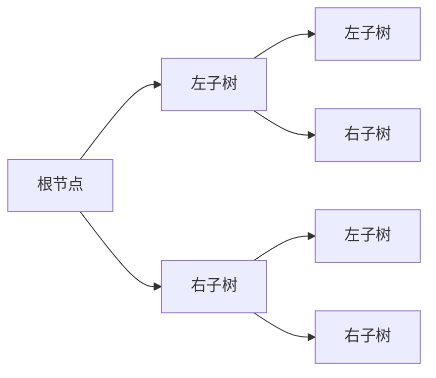
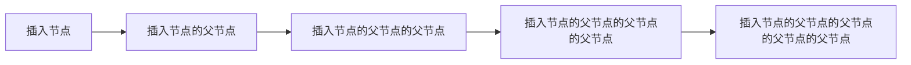
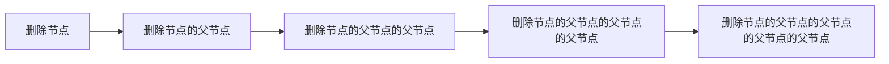

# 7. 平衡二叉树

## 什么是平衡二叉树

平衡二叉树（Balanced Binary Tree）又被称为AVL树（有别于AVL算法），且具有以下性质：
- 它是一棵空树
- 它的左右两个子树的高度差的绝对值不超过1
- 它的左右两个子树都是一棵平衡二叉树

- 结构



## 为什么要用平衡二叉树

平衡二叉树的查找、插入、删除操作的时间复杂度都是O(logn)，这是二叉树的最优时间复杂度。而普通的二叉树，由于没有平衡性，其时间复杂度会退化到O(n)。

## 如何实现平衡二叉树

### 旋转

平衡二叉树的实现，主要是通过旋转来实现的。旋转分为左旋和右旋，分别对应于LL型和RR型不平衡。

#### 左旋

左旋的过程:


左旋的代码实现:

```c
void left_rotate(BiTree *T) {
    BiTree L;
    L = (*T)->lchild;
    (*T)->lchild = L->rchild;
    L->rchild = (*T);
    (*T) = L;
}
```

#### 右旋

右旋的过程:


右旋的代码实现:

```c
void right_rotate(BiTree *T) {
    BiTree R;
    R = (*T)->rchild;
    (*T)->rchild = R->lchild;
    R->lchild = (*T);
    (*T) = R;
}
```

### 插入

插入的过程:



插入的代码实现:

```c
void insert(BiTree *T, int key) {
    if (!(*T)) {
        *T = (BiTree)malloc(sizeof(BiTNode));
        (*T)->data = key;
        (*T)->lchild = (*T)->rchild = NULL;
        return;
    } else if (key < (*T)->data) {
        insert(&(*T)->lchild, key);
        if (height((*T)->lchild) - height((*T)->rchild) == 2) {
            if (key < (*T)->lchild->data) {
                right_rotate(T);
            } else {
                left_rotate(&(*T)->lchild);
                right_rotate(T);
            }
        }
    } else if (key > (*T)->data) {
        insert(&(*T)->rchild, key);
        if (height((*T)->rchild) - height((*T)->lchild) == 2) {
            if (key > (*T)->rchild->data) {
                left_rotate(T);
            } else {
                right_rotate(&(*T)->rchild);
                left_rotate(T);
            }
        }
    }
}
```

### 删除

删除的过程:



删除的代码实现:

```c
void delete(BiTree *T, int key) {
    if (!(*T)) {
        return;
    } else if (key < (*T)->data) {
        delete(&(*T)->lchild, key);
        if (height((*T)->rchild) - height((*T)->lchild) == 2) {
            BiTree R = (*T)->rchild;
            if (height(R->lchild) > height(R->rchild)) {
                right_rotate(&(*T)->rchild);
                left_rotate(T);
            } else {
                left_rotate(T);
            }
        }
    } else if (key > (*T)->data) {
        delete(&(*T)->rchild, key);
        if (height((*T)->lchild) - height((*T)->rchild) == 2) {
            BiTree L = (*T)->lchild;
            if (height(L->rchild) > height(L->lchild)) {
                left_rotate(&(*T)->lchild);
                right_rotate(T);
            } else {
                right_rotate(T);
            }
        }
    } else {
        if ((*T)->lchild && (*T)->rchild) {
            BiTree p = (*T)->rchild;
            while (p->lchild) {
                p = p->lchild;
            }
            (*T)->data = p->data;
            delete(&(*T)->rchild, p->data);
        } else {
            BiTree p = *T;
            *T = (*T)->lchild ? (*T)->lchild : (*T)->rchild;
            free(p);
        }
    }
}
```

## 代码

```c
#include <stdio.h>

typedef struct BiTNode {
    int data;
    struct BiTNode *lchild, *rchild;
} BiTNode, *BiTree;

int height(BiTree T) {
    if (!T) {
        return 0;
    }
    int l = height(T->lchild);
    int r = height(T->rchild);
    return l > r ? l + 1 : r + 1;
}

void left_rotate(BiTree *T) {
    BiTree L;
    L = (*T)->lchild;
    (*T)->lchild = L->rchild;
    L->rchild = (*T);
    (*T) = L;
}

void right_rotate(BiTree *T) {
    BiTree R;
    R = (*T)->rchild;
    (*T)->rchild = R->lchild;
    R->lchild = (*T);
    (*T) = R;
}

void insert(BiTree *T, int key) {
    if (!(*T)) {
        *T = (BiTree)malloc(sizeof(BiTNode));
        (*T)->data = key;
        (*T)->lchild = (*T)->rchild = NULL;
        return;
    } else if (key < (*T)->data) {
        insert(&(*T)->lchild, key);
        if (height((*T)->lchild) - height((*T)->rchild) == 2) {
            if (key < (*T)->lchild->data) {
                right_rotate(T);
            } else {
                left_rotate(&(*T)->lchild);
                right_rotate(T);
            }
        }
    } else if (key > (*T)->data) {
        insert(&(*T)->rchild, key);
        if (height((*T)->rchild) - height((*T)->lchild) == 2) {
            if (key > (*T)->rchild->data) {
                left_rotate(T);
            } else {
                right_rotate(&(*T)->rchild);
                left_rotate(T);
            }
        }
    }
}

void delete(BiTree *T, int key) {
    if (!(*T)) {
        return;
    } else if (key < (*T)->data) {
        delete(&(*T)->lchild, key);
        if (height((*T)->rchild) - height((*T)->lchild) == 2) {
            BiTree R = (*T)->rchild;
            if (height(R->lchild) > height(R->rchild)) {
                right_rotate(&(*T)->rchild);
                left_rotate(T);
            } else {
                left_rotate(T);
            }
        }
    } else if (key > (*T)->data) {
        delete(&(*T)->rchild, key);
        if (height((*T)->lchild) - height((*T)->rchild) == 2) {
            BiTree L = (*T)->lchild;
            if (height(L->rchild) > height(L->lchild)) {
                left_rotate(&(*T)->lchild);
                right_rotate(T);
            } else {
                right_rotate(T);
            }
        }
    } else {
        if ((*T)->lchild && (*T)->rchild) {
            BiTree p = (*T)->rchild;
            while (p->lchild) {
                p = p->lchild;
            }
            (*T)->data = p->data;
            delete(&(*T)->rchild, p->data);
        } else {
            BiTree p = *T;
            *T = (*T)->lchild ? (*T)->lchild : (*T)->rchild;
            free(p);
        }
    }
}

void pre_order(BiTree T) {
    if (T) {
        printf("%d ", T->data);
        pre_order(T->lchild);
        pre_order(T->rchild);
    }
}

int main() {
    int n, key;
    BiTree T = NULL;
    scanf("%d", &n);
    for (int i = 0; i < n; i++) {
        scanf("%d", &key);
        insert(&T, key);
    }
    pre_order(T);
    printf("\n");
    scanf("%d", &n);
    for (int i = 0; i < n; i++) {
        scanf("%d", &key);
        delete(&T, key);
    }
    pre_order(T);
    printf("\n");
    return 0;
}
```

## 总结

本题的难点在于删除节点后的平衡操作，需要考虑四种情况，分别是左左、左右、右右、右左，每种情况下的平衡操作都不一样，需要仔细分析。
