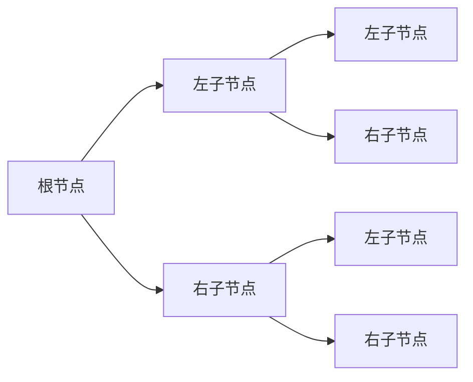
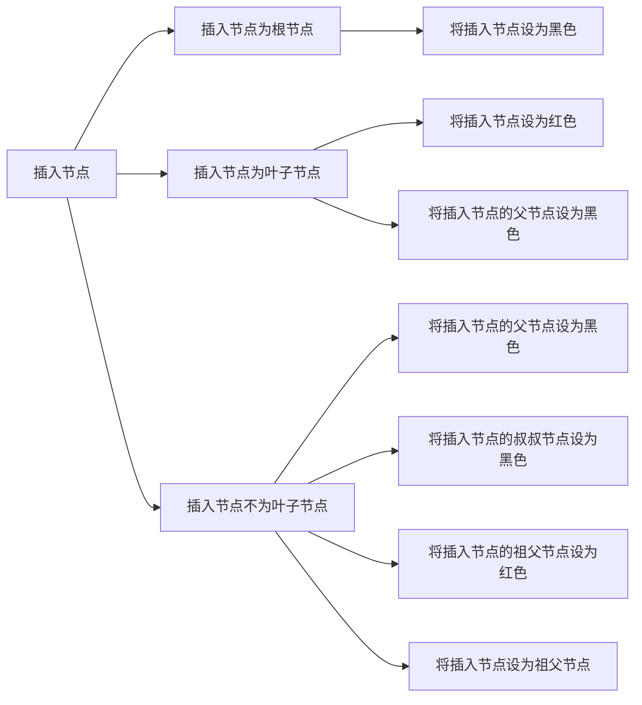
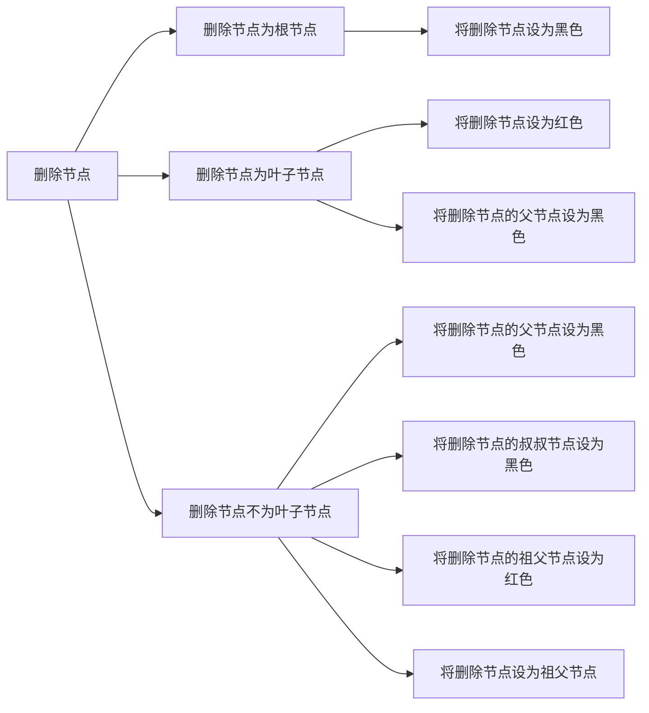

# 8. 红黑树

## 定义

红黑树是一种自平衡的二叉查找树，它满足以下性质：
- 每个节点或者是红色，或者是黑色。
- 根节点是黑色。
- 每个叶子节点（NIL）是黑色。 [^1]
- 如果一个节点是红色的，则它的子节点必须是黑色的。
- 从一个节点到该节点的子孙节点的所有路径上包含相同数目的黑节点。
- 红黑树的高度不会超过 2log(n+1)。
- 红黑树的高度不会低于 log(n+1)。

[^1]: 这里的叶子节点指的是空节点（NIL），而非指树中的叶子节点。

## 结构

红黑树的结构如下图所示：



## 操作

### 插入

插入操作的伪代码如下：



代码实现如下：

```go
func (t *Tree) Insert(key int) {
    node := &Node{Key: key, Color: RED}
    if t.Root == nil {
        t.Root = node
        t.Root.Color = BLACK
        return
    }
    t.insert(t.Root, node)
}

func (t *Tree) insert(parent, node *Node) {
    if node.Key < parent.Key {
        if parent.Left == nil {
            parent.Left = node
            node.Parent = parent
            t.fixAfterInsertion(node)
        } else {
            t.insert(parent.Left, node)
        }
    } else {
        if parent.Right == nil {
            parent.Right = node
            node.Parent = parent
            t.fixAfterInsertion(node)
        } else {
            t.insert(parent.Right, node)
        }
    }
}

func (t *Tree) fixAfterInsertion(node *Node) {
    parent := node.Parent
    if parent == nil {
        node.Color = BLACK
        return
    }
    if parent.Color == BLACK {
        return
    }
    uncle := parent.sibling()
    grand := parent.Parent
    if uncle != nil && uncle.Color == RED {
        parent.Color = BLACK
        uncle.Color = BLACK
        grand.Color = RED
        t.fixAfterInsertion(grand)
        return
    }
    if parent == grand.Left {
        if node == parent.Right {
            t.rotateLeft(parent)
            node = parent
            parent = node.Parent
        }
        t.rotateRight(grand)
    } else {
        if node == parent.Left {
            t.rotateRight(parent)
            node = parent
            parent = node.Parent
        }
        t.rotateLeft(grand)
    }
    parent.Color = BLACK
    grand.Color = RED
}
```

### 删除

删除操作的伪代码如下：



## 参考

- [红黑树](https://zh.wikipedia.org/wiki/%E7%BA%A2%E9%BB%91%E6%A0%91)
- [红黑树原理算法介绍](https://www.cnblogs.com/skywang12345/p/3245399.html)
- [红黑树的插入与删除](https://www.cnblogs.com/skywang12345/p/3624343.html)
